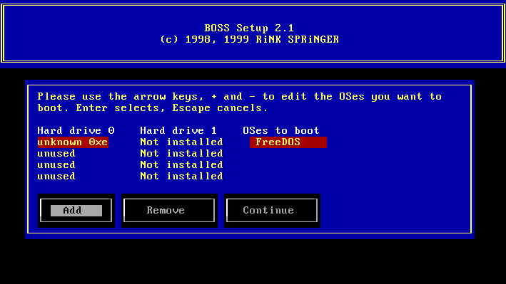
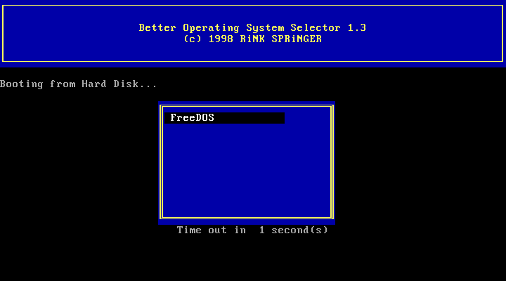

# Better Operating System Selector (BOSS)

BOSS, or _Better Operating System Selector_, is the bootmanager I coded back in 1998. It was the first piece of code I released over the internet.

 You can find more information in the [readme.txt](releases/readme.txt) file. Simtel and mirrors have ancient versions of this program, this repository includes all releases including sources when available. Note that the installer/setup tool is maybe the first serious C/C++ code I ever wrote, so don't let it scare you. I've learned a lot since then :-)

## Screenshot

## Downloads

   * [BOSS 1.3](releases/boss13.zip) (37KB)
   * [BOSS 1.3 source code](releases/boss13s.zip) (29KB)
   * [BOSS 1.2.1](releases/boss121.zip) (33KB)
   * [BOSS 1.2.1 source code](releases/boss121s.zip) (25KB)
   * [BOSS 1.2](releases/boss120.zip) (33KB)
   * [BOSS 1.1](releases/boss110.zip) (29KB)
